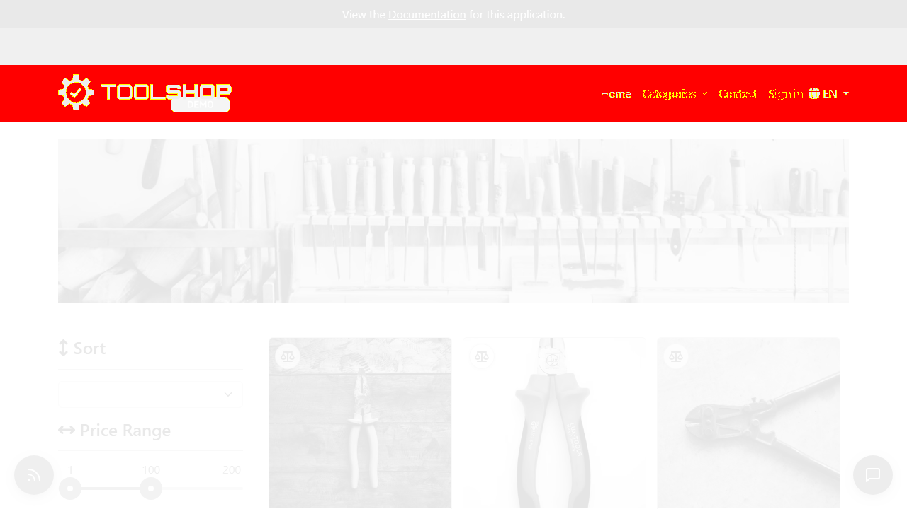
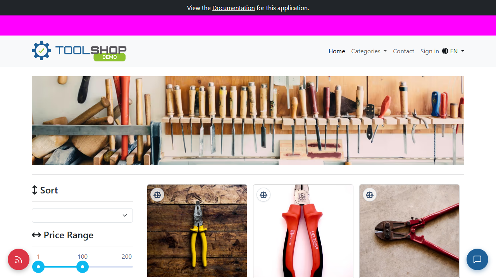
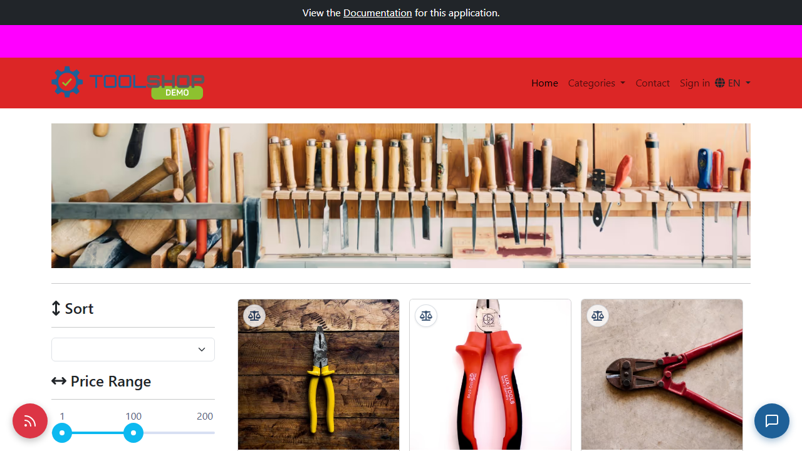

# Playwright Visual Regression

Playwright **built-in snapshot** comparison (`expect().toHaveScreenshot()`) against the [Toolshop](https://practicesoftwaretesting.com) UI.

This template demonstrates four things agencies need to show clients:

1. **Built-in Playwright snapshots** — no Percy/Chromatic required  
2. **Baseline management** — baselines committed in git, updated with one command  
3. **Dynamic region masking** — flaky areas excluded from pixel compare  
4. **Deliberate failure + diff** — proof the framework catches UI breaks  

### Diff proof (deliberate break)

The `@demo` test injects a **red navbar** and fails against the committed baseline. Playwright highlights every changed pixel:

<p align="center">
  
</p>

<p align="center"><em>~97k pixels (11%) differ · regenerate with <code>npm run demo:diff</code></em></p>

---

## What this catches

Compares live screenshots to committed **baseline PNGs**. Any unexpected pixel change fails the test and produces **Expected · Actual · Diff** images.

| Screen | Baseline file | Notes |
|---|---|---|
| Home catalog | `home-catalog.png` | Viewport capture, dynamic areas masked |
| Product detail | `product-detail.png` | Product ID from Toolshop API |

---

## Setup

```powershell
npm install
npx playwright install chromium
copy .env.example .env
```

---

## Run

```powershell
npm run test:smoke        # CI journey — must pass (@smoke only)
npm test                  # all tests except @demo; opens summary report
npm run test:update-snapshots   # refresh baselines after intentional UI change
npm run demo:diff         # deliberate failure → refreshes assets/*.png
npm run report            # Playwright HTML report (interactive diffs)
```

**Important:** `@smoke` tests must pass in CI. The `@demo` test **must fail** — it injects a breaking UI change on purpose to generate diff images for this README.

---

## 1. Built-in Playwright snapshots

Tests call Playwright's native matcher:

```javascript
await expect(page).toHaveScreenshot('home-catalog.png', {
  fullPage: false,
  mask: dynamicMasks(page),
});
```

Playwright stores baselines beside the spec file:

```
tests/catalog-visual.spec.js-snapshots/
  home-catalog.png      ← committed baseline (expected)
  product-detail.png
```

On each run Playwright captures a new screenshot, compares pixel-by-pixel (`maxDiffPixelRatio` default **1%**), and on mismatch writes **actual** + **diff** attachments.

---

## 2. Baseline management

| Task | Command |
|---|---|
| First-time / intentional UI change | `npm run test:update-snapshots` |
| Commit new baselines | `git add tests/catalog-visual.spec.js-snapshots` |
| Review what changed | Open PR diff on `*.png` snapshots |

Baselines are **version-controlled** — reviewers see visual changes in git like any other file.

**Platform:** Baselines are generated on **Windows + Chromium**. CI uses `windows-latest` so local and CI renders match.

---

## 3. Mask dynamic regions

Some UI areas change between runs (notification text, profile state). Comparing them causes false failures.

`src/utils/visualHelpers.js` masks them before screenshot:

```javascript
function dynamicMasks(page) {
  return [
    page.locator('.testing-notification-bar'),
    page.locator('[data-test="nav-profile"]'),
  ];
}
```

Masked regions appear as **pink boxes** in Playwright's diff output — they are excluded from the pixel comparison.

---

## 4. Deliberate failure — Expected · Actual · Diff

The `@demo` test injects a red navbar (simulating a breaking CSS deploy) and compares against the real baseline. It **always fails** and produces diff artifacts.

```powershell
npm run demo:diff
```

That command runs the demo test, copies Playwright's output to `assets/`, and exits successfully only if a diff was captured.

**Expected (baseline)**

<p align="center">
  
</p>

**Actual (broken UI — red navbar injected)**

<p align="center">
  
</p>

**Diff (what fails the test — changed pixels highlighted)**

<p align="center">
  
</p>

To reproduce locally:

```powershell
npx playwright test --grep @demo
# Exit code 1 — inspect test-results/ or run npm run demo:diff
```

---

## Reporting

After `npm test` or a failed run:

| Report | Path | Audience |
|---|---|---|
| Visual summary | `reports/visual-summary.html` | Stakeholders — Expected / Actual / Diff side-by-side |
| Playwright HTML | `playwright-report/index.html` | Developers — click-through attachment viewer |
| JSON results | `reports/visual-results.json` | CI / tooling |

CI uploads **`visual-regression-reports`** artifact (`playwright-report/` + `reports/`).

---

## CI

GitHub Actions runs **`npm run test:smoke` only** (`@smoke` tag). The intentional `@demo` failure is for local/README proof, not CI.

---

## Environment

| Variable | Default |
|---|---|
| `UI_BASE_URL` | `https://practicesoftwaretesting.com` |
| `API_BASE_URL` | `https://api.practicesoftwaretesting.com` |
| `HEADLESS` | `true` |
| `MAX_DIFF_PIXEL_RATIO` | `0.01` |
